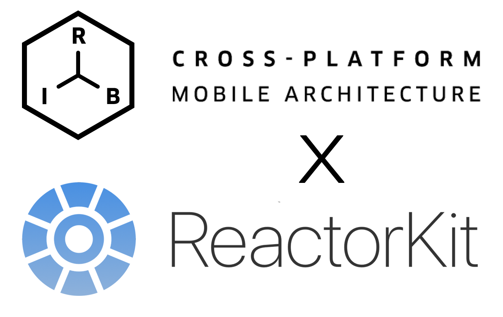

# RIBsReactorKit

[RIBs](https://github.com/uber/RIBs) X [ReactorKit](https://github.com/ReactorKit/ReactorKit) PoC



### Related post
- [medium](https://blog.mathpresso.com/ribs에-reactorkit-도입하기-6593124a34ec)

### install

Required Xcode 12.5 or above
```shell
$ sh install.sh
```

---
## Use RIBsTreeViewer

### Installing 

```
$ npm install yarn
```

### Starting the websocket server

```shell
$ cd ./RIBsTreeViewer/WebSocketServer
$ npx yarn install
$ node index.js
```

## Open the page.

```shell
$ cd ./RIBsTreeViewer/Browser
$ npx yarn install
$ npx webpack
$ open ./public/index.html
```
